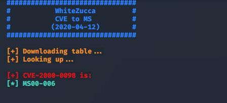

# CVEtoMS.py
Simple program to search for MS exploit code from CVE.
The "database" used is the CVEMS.html file, that is the html of https://cve.mitre.org/data/refs/refmap/source-MS.html.
This page contains the table with the CVE MS reference.
This material is subjected to a Terms of Use, please read "TermsofUse" file.

## Why
I created this simple script during a CTF from hackthebox. Using Windows Exploit Suggester i got lots of exploits, with the relative CVE number. Using this simple program i can easly get the MS code from CVE number.

## Usage
Usage: `python3 cvems.py -c CVE-2000-0053`
The CVE number must be formatted as the example (CVE-xxxx-xxxx).

## Example

